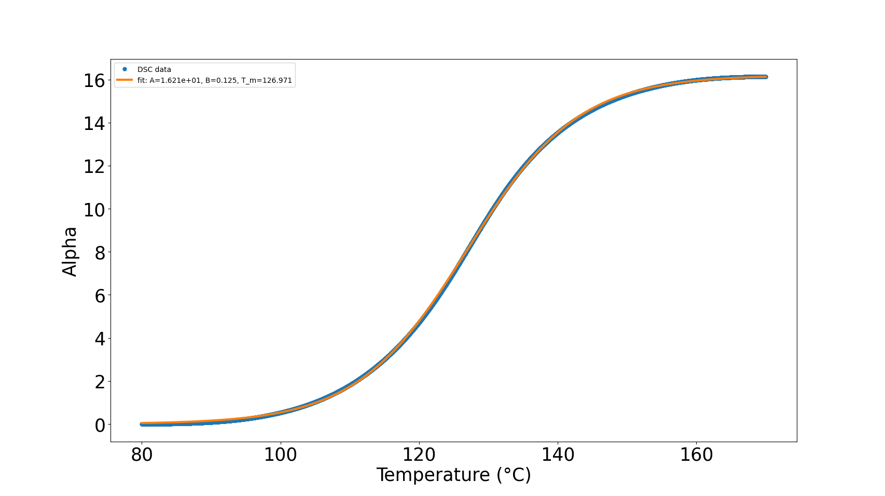
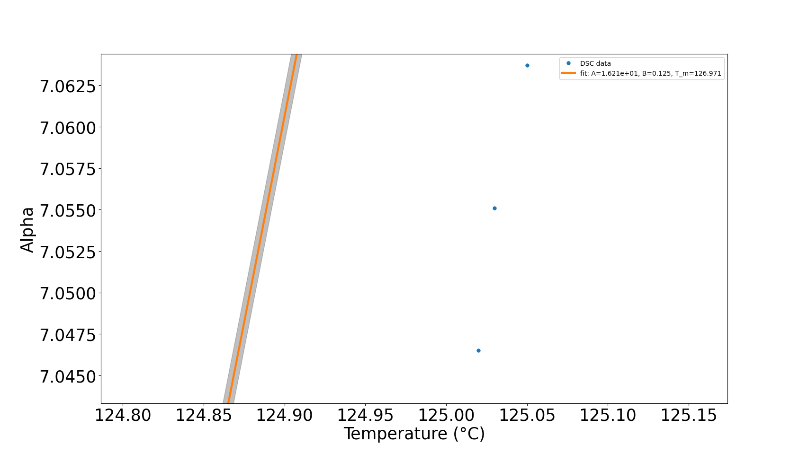
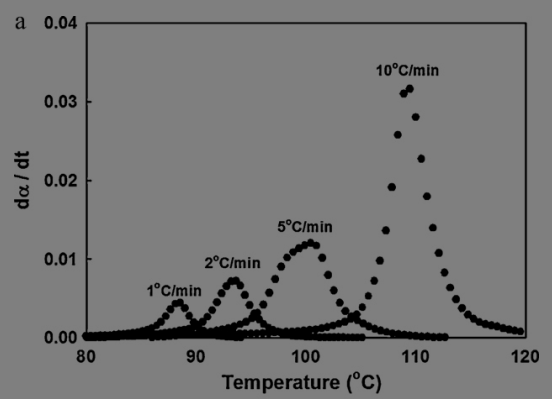
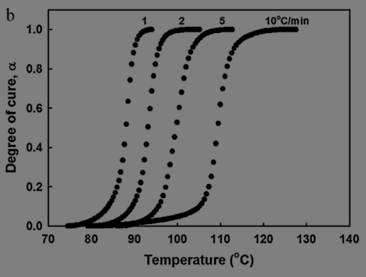
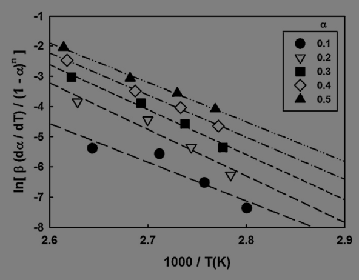
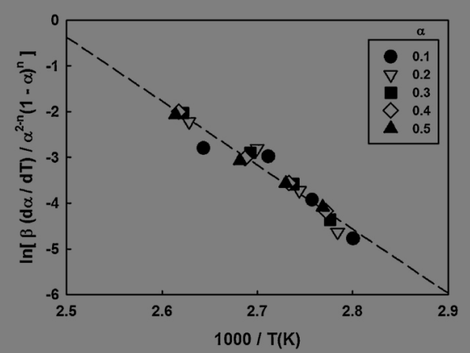

# DSC Sigmoid Fitting

This Python script is used for fitting a sigmoid function to DSC data. The dataset is expected to be in a CSV file, with columns for temperature (Temp) and alpha (Alpha).

### example sigmoid fit plot:

### magnified view:

## Dependencies
The script uses the following Python libraries:

- pandas
- scipy
- numpy
- matplotlib

## How it works
The script first loads a CSV file from the CSVs directory.

It then defines a sigmoid function:

$$ f(x) = \frac{A}{1 + e^{-(x-T_m)/B}} $$

where A is the maximum value of $\alpha$, B is the steepness, and T_m is the temperature at the midpoint (see [theory](#Theory) section for more detail).

With an initial guess for these parameters and the curve_fit function from the scipy.optimize library, the script fits the sigmoid function to the data. The data and fit are plotted and the parameters and error are printed.

## Usage
Run this script in a Python environment with the necessary libraries installed. Move your CSV file to the CSV folder with the correct format and adjust the file path in the script.

Please note that you may need to adjust initial guess for the parameters depending on your specific dataset.

# Theory

- **Maximum turnover (A)** indicates the asymptotic maximum of the turnover or the response measured in the DSC. In chemical terms, this might represent the maximum extent of a reaction, such as a phase transition (e.g., melting, crystallization), a polymerization degree, or the total heat capacity change in the system under a specific condition. The magnitude of A gives insight into the total enthalpic change associated with the process.
- **Steepness of the curve (B)** describes how sharply the transition occurs with respect to temperature. A higher value of B suggests a more abrupt transition, typical of first-order transitions like melting. A smaller B indicates a more gradual change, which might be typical for second-order transitions or reactions where multiple intermediate states or slower kinetics are involved. This can be important for understanding reaction mechanisms, the stability of phases, or the kinetics of transitions.
- **Midpoint temperature ($T_m$)** represents the temperature at which the response is half of its maximum value. This is often interpreted as the "transition temperature." For instance, in the context of polymer science, might represent the glass transition temperature, melting temperature, or crystallization temperature, depending on the context. It is crucial for assessing material properties, designing chemical processes, or comparing the thermal stability of different materials.

## Kinetics from Hong and Lee paper [[1]](##References)
DSC data can be used to explore cure kinetics

### DSC conversion rate:

and expressing the conversion rate instead as an fraction of total conversion,

### conversion:

the resulting data can be used in Chang plots to determine the activation energy, pre-exponential factor, and (maybe?) reaction order.

### Chang plot (unmodified):

### Chang plot (modified by Hong et al.):

This process is described here:

## Chang Plotting
Crosslinking polymer systems undergoing isothermal reactions are discussed in terms of "conversion," $\alpha$, and the rate of conversion $\frac{d\alpha}{dt}$ for a reaction is assumed to change linearly with the reaction rate constant $k$:

$$\frac{d\alpha}{dt} = k(T)f(\alpha)$$

where k is

$$k(T) = k_0 \cdot exp\left(\frac{-E_a}{RT}\right)$$

and $k_0$ is the pre-exponential factor, $E_a$ is the activation energy, R is the gas constant, and T is the temperature.  

Along with the heating rate $\beta$,

$$\beta = \frac{dT}{dt}$$

this data can be used to construct a a Chang plot where

$$ln[\frac{\beta\frac{da}{dT}}{(1-\alpha)^n}]$$

is plotted against

$$\frac{1000}{T}$$

and the slope and intercept of the linear fit to this plot represent the activation energy and pre-exponential factor, respectively, for the reaction.

## References
1. In-Kwon Hong, Sangmook Lee, ["Cure kinetics and modeling the reaction of silicone rubber"](https://www.sciencedirect.com/science/article/abs/pii/S1226086X12001645) (2013) Journal of Industrial and Engineering Chemistry, 19, 6, 2041-2046